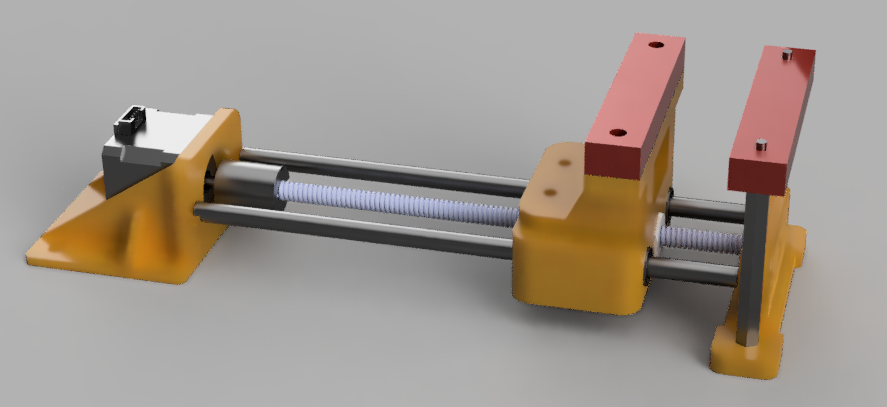
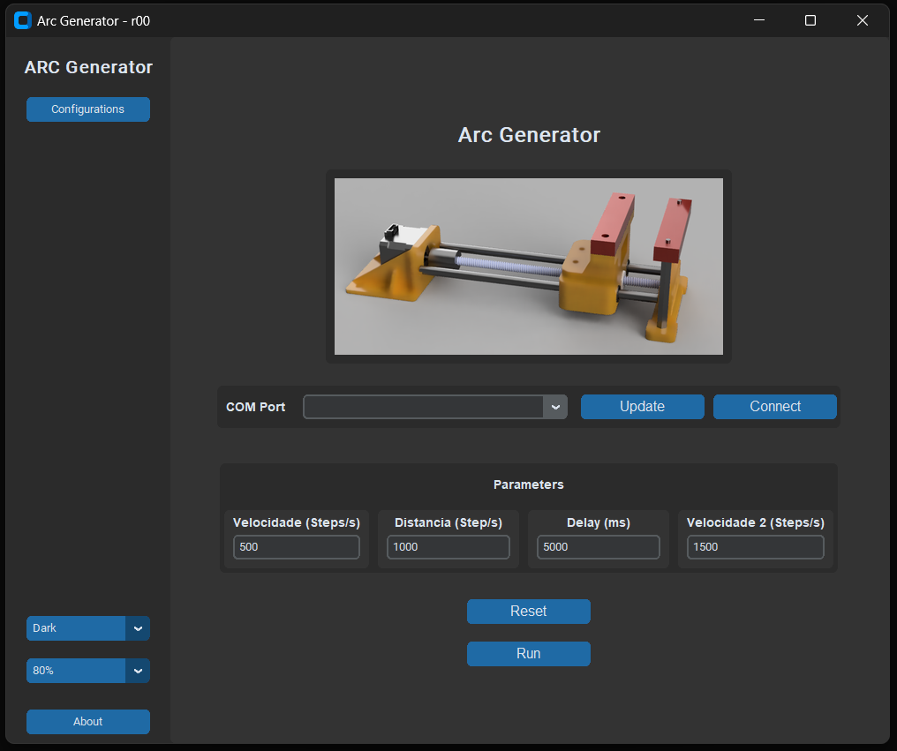
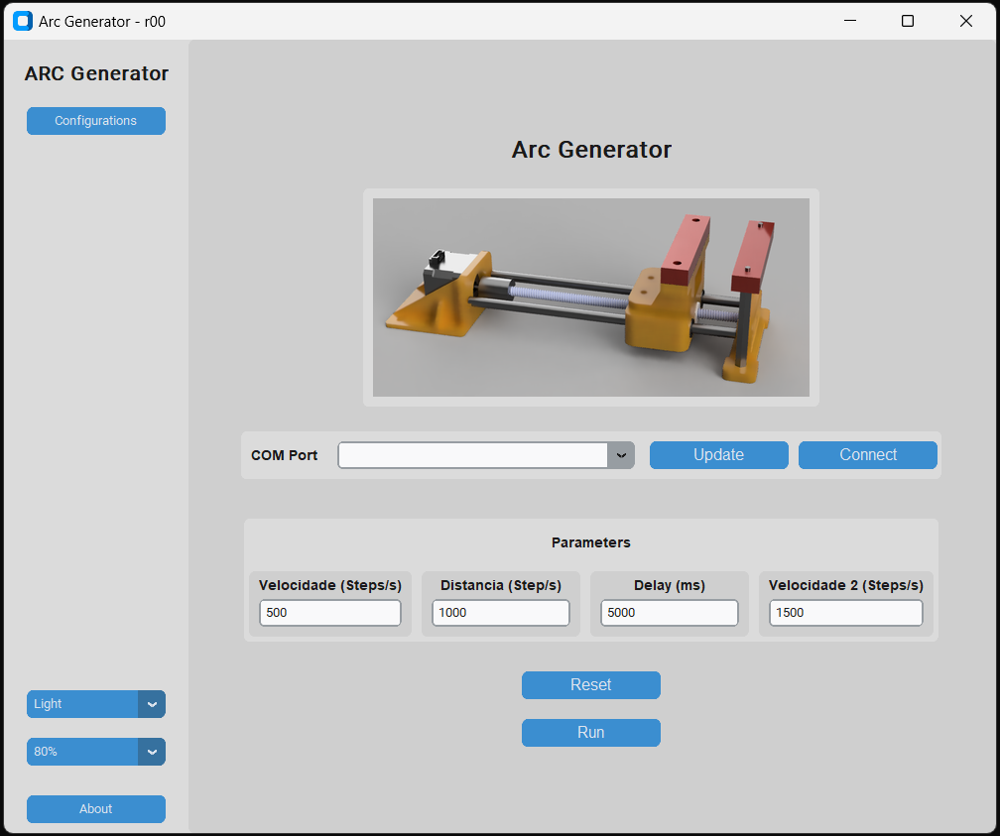

# Arc Generator para Testes de AFCI

O *Arc Generator* é um dispositivo utilizado para simular e testar condições de falha de arco elétrico, essencial para validar o funcionamento de um *Arc Fault Circuit Interrupter* (AFCI). Os AFCIs são dispositivos de proteção projetados para detectar e interromper falhas de arco, que podem gerar incêndios devido a sobrecarga ou falhas no isolamento dos fios.

## Objetivo do Arc Generator

O propósito principal do *Arc Generator* é criar condições controladas de arco para:

1. **Testar a Sensibilidade do AFCI**: Verificar se o dispositivo de proteção detecta e reage corretamente à falha.
2. **Simular Diferentes Condições de Falha de Arco**: Permitir que o AFCI seja exposto a diferentes tipos de arco, como arcos de série e paralelos.
3. **Garantir Conformidade com Normas de Segurança**: Certificar-se de que o AFCI está em conformidade com padrões como UL 1699, que exige testes rigorosos com falhas simuladas.

## Aplicativo

    
    

